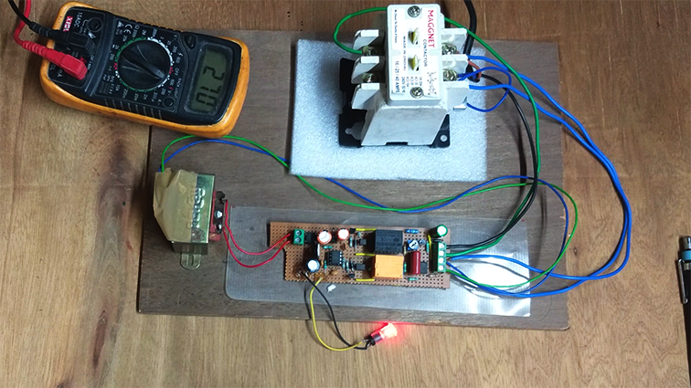
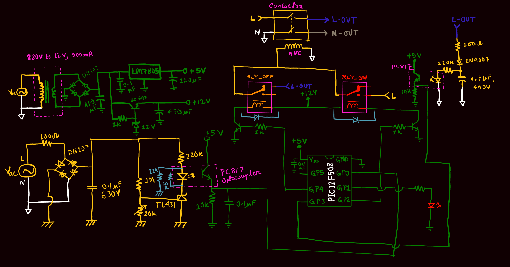

# Over-Voltage-Protection-Circuit_PIC12F508

This project is about designing an over voltage protection circuit for household single phase ac mains supply.
This repo contains the c code for PIC12F508 µC. I built the project using MPLABX IDE and Hi-Tech C compiler. To use XC8 compiler you need to change the header file <htc.h> to <xc.h> and also modify the configuration lines.

**Figure:** Circuit on a Prefboard

**Figure:** Schematic Circuit Diagram

-[Watch Video on YouTube]()
